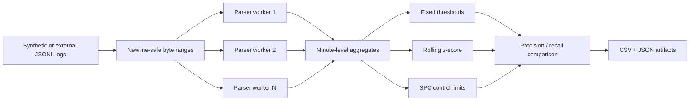

# Automated Log Analysis & Anomaly Detection Pipeline

[](https://github.com/wstesia/log-anomaly-pipeline/actions/workflows/ci.yml)
[](https://www.python.org/)

A production-style Python pipeline that turns raw JSONL server logs into minute-level metrics, detects traffic and error anomalies, and evaluates each detector against injected ground-truth labels. Parsing is parallelized by byte range and workers aggregate locally, allowing large files to be processed without collecting every event in memory.

## Highlights

- Splits individual files into newline-safe byte ranges and processes them with `multiprocessing`
- Validates structured events while counting malformed records instead of failing an entire run
- Compares fixed thresholds, rolling z-scores, and statistical process control on identical labeled data
- Uses past-only rolling baselines with contamination protection to avoid look-ahead bias
- Produces reviewable CSV and JSON artifacts rather than opaque model output
- Includes deterministic data generation, unit tests, coverage enforcement, linting, and CI

## Quick start

```bash
git clone https://github.com/wstesia/log-anomaly-pipeline.git
cd log-anomaly-pipeline
python3 -m venv .venv
source .venv/bin/activate
python -m pip install -e ".[dev]"

# Generate three hours of labeled traffic and run the full analysis.
log-analyzer demo --output-dir artifacts/demo --minutes 180 --seed 42
```

The demo generates four log shards, analyzes them with the rolling z-score detector, evaluates all three approaches, and writes results under `artifacts/demo/analysis/`.

## Pipeline



Each worker returns compact bucket summaries—not raw events—so parent-process memory grows with the number of time buckets instead of the number of log lines. Lines crossing a partition boundary are assigned to exactly one worker.

## Detectors

| Approach | Baseline | Strength | Main tradeoff |
|---|---|---|---|
| Fixed threshold | Explicit request/error limits | Simple and predictable | Requires workload-specific tuning |
| Rolling z-score | Recent accepted observations | Adapts to gradual traffic changes | Requires a warm-up period |
| Statistical process control | Initial calibration window | Easy-to-explain control limits | Static limits can drift out of date |

The rolling detector is the default because it gave the best precision/recall tradeoff on the seeded labeled workload. It calculates scores from prior observations only. Once a point is flagged, that value is not admitted into the rolling baseline, which prevents a sustained incident from immediately normalizing itself.

Default demo results (`180` minutes, seed `42`):

| Detector | Precision | Recall | F1 |
|---|---:|---:|---:|
| Rolling z-score | 0.857 | 1.000 | **0.923** |
| Statistical process control | 0.750 | 1.000 | 0.857 |
| Fixed threshold | 1.000 | 0.500 | 0.667 |

## Commands

Generate deterministic synthetic logs:

```bash
log-analyzer generate \
  --output-dir data/generated \
  --minutes 180 \
  --base-rpm 120 \
  --shards 4 \
  --seed 42
```

Analyze a directory or one or more files:

```bash
log-analyzer analyze data/generated \
  --detector rolling-zscore \
  --workers 4 \
  --output-dir artifacts/analysis
```

Benchmark parser scaling on the same input:

```bash
log-analyzer benchmark data/generated \
  --workers 1 2 4 8 \
  --repeats 3 \
  --chunk-size-mb 64 \
  --output benchmark_results/parser.csv
```

Run `log-analyzer --help` or `log-analyzer <command> --help` for all options.

## Input schema

The parser expects newline-delimited JSON with the following fields:

```json
{"timestamp":"2026-04-01T00:00:01.250Z","service":"api","endpoint":"/v1/items","status":200,"latency_ms":43.2,"bytes_sent":1290,"anomaly":null}
```

| Field | Type | Notes |
|---|---|---|
| `timestamp` | ISO-8601 string | Timezone required; normalized to UTC |
| `service` | string | Non-empty service name |
| `endpoint` | string | Must begin with `/` |
| `status` | integer | HTTP range 100–599; 5xx counts as an error |
| `latency_ms` | number | Non-negative |
| `bytes_sent` | integer | Non-negative |
| `anomaly` | string or null | `traffic_spike`, `error_rate_jump`, or `null` |

The label field is used only for evaluation; no detector can read it when forming predictions.

## Output artifacts

| File | Contents |
|---|---|
| `minute_metrics.csv` | Aggregated metrics, labels, scores, predictions, and reasons |
| `anomalies.csv` | Only buckets flagged by the selected detector |
| `detector_comparison.csv` | Precision, recall, F1, accuracy, and confusion counts |
| `run_summary.json` | Parser throughput, malformed-row count, selected metrics, and artifact paths |

## Performance

The project benchmark used a 10 GB synthetic log dataset with the same schema and processing path:

| Mode | Wall time | Relative speed |
|---|---:|---:|
| Single process | 18.4 min | 1.00× |
| Multiprocessing | 7.9 min | 2.33× |

That is a 57% reduction in wall-clock time. Results depend on CPU count, storage throughput, file layout, and chunk size; the `benchmark` command is included so results can be reproduced on other machines rather than treated as universal.

## Development

```bash
make lint
make test
```

Tests cover schema validation, malformed input, byte-range boundaries, single/parallel equivalence, detector logic, metric calculation, the CLI error path, and a complete generation-to-artifact run. CI runs the suite on Python 3.10 and 3.13.

## Assumptions and limitations

- Input is JSONL and each event fits on one line; compressed files must be decompressed first.
- Detection operates on one-minute buckets. Sub-minute incidents may be diluted by aggregation.
- Error rate currently means HTTP 5xx responses divided by request count.
- The default thresholds and window sizes are starting points, not universal production settings.
- Labels are available for generated data. Real deployments need analyst review or a separate incident source for evaluation.
- Multiprocessing speedup becomes I/O-bound as worker count increases, so more workers do not always improve throughput.

## License

MIT
